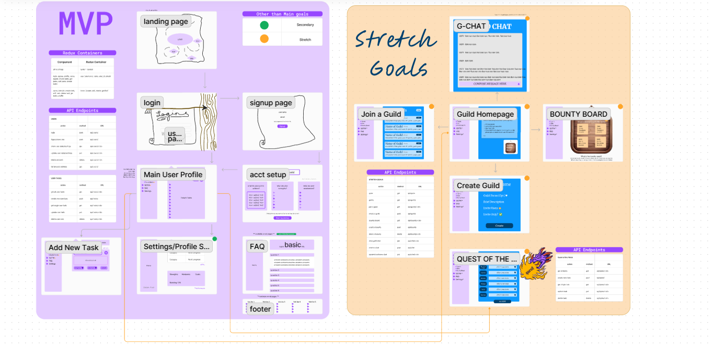
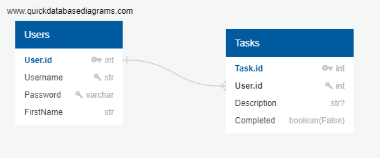

# LifeQuest

## Team as of October 2024
-   Katie

## Team as of September 2024:
-   Dylan - Python, SQL, FastAPI, Redux
-   Emily - Python, FastAPI, React/JS
-   Katie - FastAPI, React/JS, Redux, HTML/CSS, Artwork
-   Mira - Python, SQL, React/JS

## KPI Tracker/Project Management Dashboard
[https://docs.google.com/spreadsheets/d/1n6MFF5Ju1rcKoPP_v1_ZlvARzUSyov7H_3dgBDerds0/edit?gid=0#gid=0](https://docs.google.com/spreadsheets/d/1n6MFF5Ju1rcKoPP_v1_ZlvARzUSyov7H_3dgBDerds0/edit?gid=0#gid=0)

## How to Run

-   Git Fork && Clone from the following repository: [https://github.com/katiegory9hurrikate/LifeQuest/](https://github.com/katiegory9hurrikate/LifeQuest)

-   CD into the new directory ${lifequest}

-   Run Docker Desktop and then initiate the following command from within your terminal:

  `docker compose up -d --build`

-   Head to http://localhost:5173/ to access the interactive front end of our application

-   Head to http://localhost:8000/docs/ to access the FastAPI UI for testing

## Creating your .env file

#### In order for the project to work properly a .env file must be created in the root directory of the project. due to the sensitive nature of the information in the .env file it is included in the .gitignore. You must include your own passwords and signing keys.

```
POSTGRES_DB="db_name"
POSTGRES_USER={"your user name"}
POSTGRES_PASSWORD={"your password for db"}
SIGNING_KEY={"your signing key goes here"}
DATABASE_URL={"postgresql://{user name}:{password}@db:5432/{db_name"}}
```

  Example:
```
POSTGRES_DB="lifequest_data"
POSTGRES_USER="testuser"
POSTGRES_PASSWORD="password"
SIGNING_KEY="super_secret_key_123"
DATABASE_URL="postgresql://testuser:password@db:5432/lifequest_data"
```

## Design

### Wireframe

[[diagram link ](https://www.figma.com/board/2WREnTq826MtDlWde5TveH/LifeQuest?node-id=0-1&node-type=CANVAS)]


### Database Model

[[database model link](https://app.quickdatabasediagrams.com/#/d/Ca0Own)]


## URLs:

### User routes:

        | Action                          | Method        | Endpoint                            |
        | --------------------------------|:-------------:| -----------------------------------:|
        | Create a new user               |     POST      | /api/auth/signup                    |
        | Sign a user in                  |     POST      | /api/auth/signin                    |
        | Sign a user out                 |     DELETE    | /api/auth/signout                   |
        | Fetch a users information       |     GET       | /api/users/${username}              |

### Quest routes:

        | Action                          | Method        | Endpoint                             |
        | --------------------------------|:-------------:| ------------------------------------:|
        | Create a new quest              |     POST      | /api/quests/create                   |
        | Get all of the users quests     |     GET       | /api/quests/mine                     |
        | Get a specific quest            |     GET       | /api/quests/mine/${quest_id}         |
        | Edit a specific quest           |     PUT       | /api/quests/mine/${quest_id}         |
        | Delete a specific quest         |     DELETE    | /api/quests/mine/${quest_id}         |

### Frontend URLs:

        | Action                          | Endpoint                                             |
        | --------------------------------|:----------------------------------------------------:|
        | Create a new user               | http://localhost:5173/signup                         |
        | Sign a user in                  | http://localhost:5173/signin                         |
        | Create a new quest*             | http://localhost:5173/create                         |
        | Get all of the users quests*    | http://localhost:5173/quests                         |
        | Edit a specific quest*          | http://localhost:5173/quests/${quest_id}             |

### Routes denoted with \* require authentication - an unauthenticated user is rerouted to sign in!

## Functionality

### What is LifeQuest?

-   LifeQuest at it's simplest is a task tracker wrapped up in the aesthetic of a quest log!

### How does it work?

-   First the user must create an account by navigating to 'sign up' and filling out the new user form

-   The user is then redirected to what would be their 'Quest Log' - however it should be empty! The user will be prompted to create their first 'quest'. Following the link will redirect you to the new quest form.

-   Upon creating your first quest (or any subsequent quests) you will be notified of your success via pop up window. The window will also ask you if you would like to create more. Responding with "ok" will reset the quest form to allow for a new entry. Selecting "cancel" instead returns the user to their Quest Log - you should now see your quests!

-   The user's quest log lists all of the users 'active'(or incompleted) quests by deafult. There will be a checkbox next to each quest under the 'status' column. Selecting the checkbox will change the quest from active to completed and filter it out of the active log. Clicking on the active button will change the display to show the completed quests instead(the buttons text will change as well).

-   Clicking on the title of a quest will bring the user to a new page in which they may edit the aforementioned quest.

-   The user may exit the experience at any time by clicking the 'logout' button and may return by simply logging in.

-   Henceforth you may keep questing by redirecting to the 'Create a Quest' link and assign yourself new challenges!

### Additional information:

-   All features of the application (except for signup) require an authenticated user. A quest cannot be created without an authorized user to assign it to. Only the user may CRUD their assigned quests.

-   The front end verifies the user data stored in the browser's cookie matches the user data of the quests. If the front end cannot detect a user it redirects them and makes only the signup and login pages accessible until a user is provided.

### Testing:

-   LifeQuest creates a testing container alongside the other docker containers when built.

-   The container will start up - run through all of the unit tests within the 'tests' folder in our api - submit it's results and then stop.

-   To rerun the tests simply restart the container.

### Installing python dependencies locally

In order for VSCode's built in code completion and intelligence to
work correctly, it needs the dependencies from the requirements.txt file
installed. We do this inside docker, but not in the workspace.

So we need to create a virtual environment and pip install the requirements.

-   From inside the `api` folder:

```bash
python -m venv .venv
```

-   Then activate the virtual environment

```bash
source .venv/bin/activate #.venv/Scripts/activate for windows users
```

-   And finally install the dependencies

```bash
pip install -r requirements.txt
```

Then make sure the venv is selected in VSCode by checking the lower right of the
VSCode status bar
